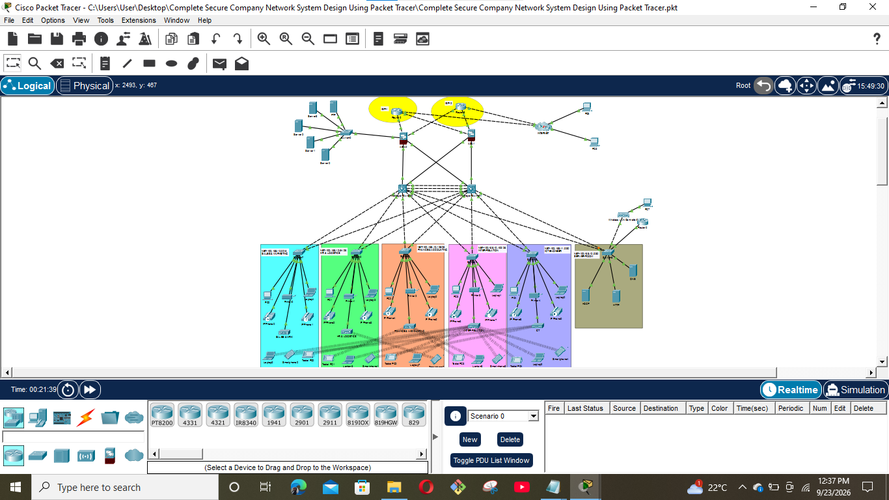

# Enterprise Campus Network — Cisco Packet Tracer Lab
<p align="center">
  
</p>

<p align="center">
  <b>A structured, secure, and scalable Complete Secure Company network designed and implemented using Cisco Packet Tracer.</b>
</p>
## 1. Project Overview

This project is a full enterprise-style Cisco Packet Tracer network designed to demonstrate the integration of:

- VLAN segmentation
- Inter-VLAN routing
- HSRP first-hop redundancy
- OSPF dynamic routing
- DHCP relay
- Centralized DHCP services
- Wireless LAN Controller (WLC)
- Server and DMZ networks
- Redundant multilayer switching
- Redundant firewall connectivity
- NAT/PAT
- Access-control policies
- Spanning Tree Protocol (PVST)
- LACP EtherChannel
- SSH management
- Switch port security
- Basic network hardening
- End-to-end connectivity and troubleshooting

The topology contains campus access switches, redundant multilayer switches, server infrastructure, wireless infrastructure, dual firewalls, routed WAN/edge links, and external connectivity.

The project is intended as a practical CCNA/enterprise-networking lab and can be used for configuration practice, troubleshooting practice, documentation, and portfolio demonstration.

---

## 2. Topology

The topology diagram is stored in the project screenshots directory.

Recommended project structure:

<p align="center">
  
</p>

The network is built around two multilayer switches providing redundant gateway services. Access switches connect users, voice devices, wireless infrastructure, and servers. Two firewalls provide redundant paths toward the external/edge routers.

A simplified logical view is:

```text
                         EXTERNAL / ISP NETWORK
                                |
                         +---------------+
                         |  Edge Routers |
                         +-------+-------+
                                 |
                    +------------+------------+
                    |                         |
                  FW1                       FW2
                    |                         |
              +-----+-------------------------+-----+
              |                                   |
        MULTILAYER-SW1                      MULTILAYER-SW2
              |                                   |
              +----------------+------------------+
                               |
                    Campus Access Layer
                               |
        +----------+----------+----------+----------+
        |          |          |          |          |
      SM-SW      ICT-SW     IR-SW      FA-SW      HL-SW
                               |
                            SVR-SW
                               |
                +--------------+--------------+
                |              |              |
              DNS            HTTP           DHCP
                               |
                              WLC
```

The exact physical topology should be verified against the Packet Tracer topology screenshot included with the project.

---

# 3. Network Design

## 3.1 VLANs

| VLAN | Purpose | Network | Default Gateway |
|---:|---|---|---|
| 10 | Management | `192.168.10.0/24` | `192.168.10.1` |
| 20 | User LAN | `172.16.0.0/16` | `172.16.0.1` |
| 50 | Wireless LAN | `10.20.0.0/16` | `10.20.0.1` |
| 70 | Voice / VoIP | `10.70.0.0/16`* | `10.70.0.1`* |
| 90 | Inside Servers | `10.11.11.32/27` | `10.11.11.33` |
| 199 | Blackhole / unused ports | Local VLAN | N/A |

> `*` VLAN 70 addressing is not fully established in the supplied configuration output. The VLAN is used for VoIP/voice access ports, but its complete Layer-3 addressing should be documented from the final Packet Tracer configuration if required.

---

# 4. Layer-3 Gateway and HSRP Design

The two multilayer switches provide redundant default gateways using HSRP.

## MULTILAYER-SW1

| SVI | Address | HSRP Virtual IP | Role |
|---|---|---|---|
| VLAN 10 | `192.168.10.3/24` | `192.168.10.1` | Active |
| VLAN 20 | `172.16.0.3/16` | `172.16.0.1` | Active |
| VLAN 50 | `10.20.0.2/16` | `10.20.0.1` | Standby |
| VLAN 90 | `10.11.11.34/27` | `10.11.11.33` | Active |

## MULTILAYER-SW2

| SVI | Address | HSRP Virtual IP | Role |
|---|---|---|---|
| VLAN 10 | `192.168.10.2/24` | `192.168.10.1` | Standby |
| VLAN 20 | `172.16.0.2/16` | `172.16.0.1` | Standby |
| VLAN 50 | `10.20.0.3/16` | `10.20.0.1` | Active |
| VLAN 90 | `10.11.11.35/27` | `10.11.11.33` | Standby |

This arrangement intentionally distributes the HSRP active role between the two multilayer switches.

### HSRP verification

```text
show standby
show standby brief
```

Expected results include:

```text
VLAN 10 -> virtual gateway 192.168.10.1
VLAN 20 -> virtual gateway 172.16.0.1
VLAN 50 -> virtual gateway 10.20.0.1
VLAN 90 -> virtual gateway 10.11.11.33
```

---

# 5. Multilayer Switching

Both multilayer switches have Layer-3 routing enabled.

```text
ip routing
```

The switches use SVIs for inter-VLAN routing.

Important routed interfaces include:

## MULTILAYER-SW1

```text
Gi1/0/1    10.2.2.5/30
Gi1/0/11   10.2.2.1/30
```

## MULTILAYER-SW2

```text
Gi1/0/1    10.2.2.13/30
Gi1/0/11   10.2.2.9/30
```

The remaining uplinks toward the access layer operate as trunks.

Verification:

```text
show ip interface brief
show interfaces trunk
show vlan brief
show ip route
```

---

# 6. EtherChannel

The multilayer switches use LACP EtherChannel for redundant/high-availability switching links.

## MULTILAYER-SW1

```text
interface Gi1/0/8
 channel-group 1 mode active

interface Gi1/0/9
 channel-group 1 mode active

interface Gi1/0/10
 channel-group 1 mode active
```

## MULTILAYER-SW2

The corresponding interfaces use LACP passive mode.

```text
channel-group 1 mode passive
```

The resulting logical interface is:

```text
Port-channel1
```

Verification:

```text
show etherchannel summary
show interfaces port-channel 1
show interfaces trunk
```

Expected state:

```text
Po1    trunking
LACP   operational
```

---

# 7. Spanning Tree

The switching environment uses Per-VLAN Spanning Tree:

```text
spanning-tree mode pvst
```

Access ports use PortFast and BPDU Guard where appropriate.

Example:

```text
interface FastEthernet0/3
 spanning-tree portfast
 spanning-tree bpduguard enable
```

Unused switch ports are placed in a blackhole VLAN where configured and should be administratively shut down.

Verification:

```text
show spanning-tree
show spanning-tree vlan 10
show spanning-tree vlan 20
show spanning-tree vlan 50
show spanning-tree vlan 90
```

---

# 8. Access Switches

The campus access layer includes:

- `SM-SW`
- `ICT-SW`
- `IR-SW`
- `FA-SW`
- `HL-SW`
- `SVR-SW`

Access switches provide VLAN membership and Layer-2 connectivity.

Typical uplink configuration:

```text
interface FastEthernet0/1
 switchport mode trunk

interface FastEthernet0/2
 switchport mode trunk
```

User-facing ports are assigned to their required VLAN.

---

# 9. Server Switch — SVR-SW

`SVR-SW` is the dedicated server/wireless aggregation switch.

Important interfaces:

| Port | Function | VLAN |
|---|---|---:|
| Fa0/1 | Trunk to MULTILAYER-SW1 | Trunk |
| Fa0/2 | Trunk to MULTILAYER-SW2 | Trunk |
| Fa0/3 | Wireless LAN Controller | 50 |
| Fa0/4 | DNS Server | 90 |
| Fa0/5 | HTTP Server | 90 |
| Fa0/6 | DHCP Server | 90 |
| Fa0/7 | Voice device | 70 |

Relevant configuration:

```text
interface FastEthernet0/3
 switchport access vlan 50
 switchport mode access
 spanning-tree portfast
 spanning-tree bpduguard enable

interface FastEthernet0/4
 switchport access vlan 90
 switchport mode access
 spanning-tree portfast
 spanning-tree bpduguard enable

interface FastEthernet0/5
 switchport access vlan 90
 switchport mode access
 spanning-tree portfast
 spanning-tree bpduguard enable

interface FastEthernet0/6
 switchport access vlan 90
 switchport mode access
 spanning-tree portfast
 spanning-tree bpduguard enable

interface FastEthernet0/7
 switchport access vlan 70
 switchport mode access
```

### Important troubleshooting correction

The DHCP server was initially connected to a VLAN 70 access port while its IP address and default gateway belonged to VLAN 90.

The port was corrected to VLAN 90:

```text
interface FastEthernet0/6
 switchport mode access
 switchport access vlan 90
 no shutdown
```

This restored Layer-2/Layer-3 reachability to the DHCP server.

---

# 10. Server Network

The server VLAN is:

```text
VLAN 90
Network: 10.11.11.32/27
Mask: 255.255.255.224
Virtual Gateway: 10.11.11.33
```

Known server addressing:

| Device | IP Address | Mask | Gateway |
|---|---|---|---|
| DHCP Server | `10.11.11.38` | `/27` | `10.11.11.33` |
| DNS Server | `10.11.11.37` | `/27` | `10.11.11.33` |
| WLC | `10.20.0.10` | `/16` | `10.20.0.1` |

---

# 11. DHCP

DHCP is centralized on:

```text
DHCP Server: 10.11.11.38
```

The multilayer switches relay DHCP requests using:

```text
ip helper-address 10.11.11.38
```

The helper is configured on the relevant SVIs.

## DHCP Pools

### WLANPool

```text
Network:        10.20.0.0/16
Gateway:        10.20.0.1
Start Address:  10.20.0.11
DNS Server:     10.11.11.37
WLC:            10.20.0.10
```

### LANPool

```text
Network:        172.16.0.0/16
Gateway:        172.16.0.1
Start Address:  172.16.0.11
DNS Server:     10.11.11.37
```

### MGTpool

```text
Network:        192.168.10.0/24
Gateway:        192.168.10.1
DNS Server:     10.11.11.37
```

### DHCP verification

On multilayer switches:

```text
show ip interface vlan 10
show ip interface vlan 20
show ip interface vlan 50
show run interface vlan 10
show run interface vlan 20
show run interface vlan 50
```

From a client:

```text
ipconfig /release
ipconfig /renew
ipconfig /all
```

---

# 12. Wireless LAN Controller

The WLC is connected to:

```text
SVR-SW Fa0/3
VLAN 50
```

The switch learned the WLC MAC address on this port:

```text
VLAN 50
0090.21DD.735C
Fa0/3
```

The intended WLC management/interface addressing is:

```text
IP Address:       10.20.0.10
Subnet Mask:      255.255.0.0
Default Gateway:  10.20.0.1
VLAN:             50
```

### WLC verification checklist

Verify on the Packet Tracer WLC:

1. Management IP is `10.20.0.10`.
2. Mask is `255.255.0.0`.
3. Default gateway is `10.20.0.1`.
4. Management interface/VLAN is associated with VLAN 50.
5. Physical connection is up.
6. The WLC is connected to `SVR-SW Fa0/3`.
7. Wireless clients receive addresses from `WLANPool`.

Connectivity should be tested from both multilayer switches:

```text
ping 10.20.0.10
```

And from a client:

```text
ping 10.20.0.10
ping 10.20.0.1
```

---

# 13. OSPF

The network uses OSPF process 35.

Example router IDs:

| Device | OSPF Router ID |
|---|---|
| MULTILAYER-SW1 | `1.1.1.1` |
| MULTILAYER-SW2 | `1.1.2.2` |
| Router | `1.1.5.5` |
| Router | `1.1.4.4` |
| FW1 | `1.1.8.8` |

The routing domain advertises internal networks including:

```text
10.2.2.0/30
10.2.2.4/30
10.2.2.8/30
10.2.2.12/30
10.11.11.0/27
10.11.11.32/27
10.20.0.0/16
172.16.0.0/16
192.168.10.0/24
105.100.50.0/30
105.100.50.4/30
197.200.100.0/30
197.200.100.4/30
```

Verification:

```text
show ip ospf neighbor
show ip route ospf
show ip protocols
```

Expected OSPF neighbors should reach:

```text
FULL
```

---

# 14. Firewall Architecture

The topology contains two Cisco ASA firewalls:

- `FW1`
- `FW2`

The firewalls provide redundant paths between the internal network and external networks.

## FW1 Interfaces

| Interface | Name | IP | Security Level |
|---|---|---|---:|
| Gi1/1 | OUTSIDE1 | `105.100.50.2/30` | 0 |
| Gi1/2 | OUTSIDE2 | `197.200.100.2/30` | 0 |
| Gi1/3 | INSIDE1 | `10.2.2.2/30` | 100 |
| Gi1/4 | INSIDE2 | `10.2.2.10/30` | 100 |
| Gi1/5 | DMZ | `10.11.11.1/27` | 70 |

FW1 has a default route through:

```text
105.100.50.1
```

and a secondary route through:

```text
197.200.100.1
```

## FW2 Interfaces

| Interface | Name | IP | Security Level |
|---|---|---|---:|
| Gi1/1 | OUTSIDE1 | `105.100.50.6/30` | 0 |
| Gi1/2 | OUTSIDE2 | `197.200.100.6/30` | 0 |
| Gi1/3 | — | `10.2.2.14/30` | 100 |
| Gi1/4 | INSIDE1 | `10.2.2.6/30` | 100 |

FW2 has redundant default routes through:

```text
105.100.50.5
197.200.100.5
```

---

# 15. Firewall NAT

NAT/PAT is configured for internal networks.

Configured networks include:

```text
172.16.0.0/16
10.20.0.0/16
10.11.11.0/27
```

The wireless network has dedicated NAT objects so WLAN clients can reach external networks.

Example:

```text
object network INSIDEw1-OUTSIDEw1
 subnet 10.20.0.0 255.255.0.0
 nat (INSIDE1,OUTSIDE1) dynamic interface
```

---

# 16. Firewall Access Control

FW1 contains an extended ACL permitting selected traffic:

```text
access-list RES extended permit icmp any any
access-list RES extended permit tcp any any eq www
access-list RES extended permit tcp any any eq domain
access-list RES extended permit udp any any eq domain
```

The ACL is applied to:

```text
DMZ
OUTSIDE1
OUTSIDE2
```

Verification:

```text
show access-list
show access-group
show nat
show xlate
```

---

# 17. DMZ

FW1 provides a DMZ interface:

```text
DMZ
IP: 10.11.11.1/27
Security Level: 70
```

The DMZ network is:

```text
10.11.11.0/27
```

This is distinct from the internal server VLAN:

```text
10.11.11.32/27
```

This separation provides logical segmentation between the firewall DMZ and the internal server segment.

---

# 18. External / Edge Routing

The edge portion of the topology includes routed point-to-point links.

One edge router uses:

```text
Gi0/0  20.20.20.2/30
Gi0/1  30.30.30.2/30
Gi0/2  8.0.0.1/8
```

The connected external network is:

```text
8.0.0.0/8
```

OSPF advertises the internal routed links and the external-facing network where configured.

Example:

```text
router ospf 35
 router-id 1.1.5.5
 network 8.0.0.0 0.0.0.3 area 0
 network 20.20.20.0 0.0.0.3 area 0
 network 30.30.30.0 0.0.0.3 area 0
```

---

# 19. Switch Security

Access switches use several basic security controls.

## Disable DNS lookup

```text
no ip domain-lookup
```

## SSH

```text
ip ssh version 2
ip domain-name cisco.com
username cisco privilege 1 password <configured-password>
```

## VTY access

SSH is permitted:

```text
line vty 0 4
 login local
 transport input ssh
```

An access list restricts management access to the management subnet:

```text
access-list 1 permit 192.168.10.0 0.0.0.255
access-list 1 deny any
```

## Banner

```text
banner motd ^CNO UNAUTHORIZED ACCESS!!!^C
```

## PortFast / BPDU Guard

Access ports use:

```text
spanning-tree portfast
spanning-tree bpduguard enable
```

---

# 20. Management Network

The management VLAN is:

```text
VLAN 10
192.168.10.0/24
```

HSRP gateway:

```text
192.168.10.1
```

Multilayer switch addresses:

```text
MULTILAYER-SW1 -> 192.168.10.3
MULTILAYER-SW2 -> 192.168.10.2
```

SSH management is restricted to this subnet on configured access switches.

---

# 21. Verification Plan

## Layer 1

Check physical status:

```text
show interfaces status
show ip interface brief
```

Expected active interfaces should show:

```text
up
up
```

---

## Layer 2

Check VLANs:

```text
show vlan brief
```

Check trunks:

```text
show interfaces trunk
```

Check MAC learning:

```text
show mac address-table
```

Check CDP:

```text
show cdp neighbors
show cdp neighbors detail
```

---

## EtherChannel

```text
show etherchannel summary
```

Check that Port-channel 1 is operational.

---

## HSRP

```text
show standby
show standby brief
```

Confirm that the virtual gateways are reachable.

---

## Layer 3

```text
show ip interface brief
show ip route
```

Test:

```text
ping 192.168.10.1
ping 172.16.0.1
ping 10.20.0.1
ping 10.11.11.33
```

---

## OSPF

```text
show ip ospf neighbor
show ip route ospf
```

Neighbors should normally be:

```text
FULL
```

---

## DHCP

From a client:

```text
ipconfig /all
```

Confirm:

- Correct IP address
- Correct subnet mask
- Correct default gateway
- Correct DNS server

---

## Server Connectivity

Test from the multilayer switches:

```text
ping 10.11.11.37
ping 10.11.11.38
```

Expected:

```text
Success rate is 100 percent
```

---

## WLC

Test:

```text
ping 10.20.0.10
```

Also verify the WLC management configuration.

---

## External Connectivity

Test an external destination such as:

```text
ping 8.0.0.10
```

A successful response confirms that the routed/NAT path toward the external network is operational.

---

# 22. Troubleshooting Performed During the Lab

## Issue 1 — DHCP clients were not receiving addresses

### Symptom

Clients failed to obtain DHCP addresses.

### Investigation

The DHCP server was configured with:

```text
IP: 10.11.11.38
Mask: /27
Gateway: 10.11.11.33
```

However, the physical switch port connected to the DHCP server was initially assigned to VLAN 70.

### Root Cause

The server belonged logically to VLAN 90 but was physically placed in VLAN 70.

### Fix

```text
interface FastEthernet0/6
 switchport mode access
 switchport access vlan 90
 no shutdown
```

### Verification

After the correction, the DHCP server could communicate with:

```text
10.11.11.33
10.11.11.34
10.11.11.35
```

and DHCP clients successfully obtained addresses.

---

# 23. ARP Troubleshooting

During troubleshooting, stale ARP information caused misleading connectivity results.

The DHCP server ARP table was cleared:

```text
arp -d
```

After clearing ARP, the server learned the correct addresses.

Example ARP entries:

```text
10.11.11.33 -> 0000.0C07.AC5A
10.11.11.34 -> 0000.0C6D.6C05
10.11.11.35 -> 0002.17B6.6904
10.11.11.38 -> 000C.8526.EE7E
```

This demonstrated the importance of checking ARP when Layer-3 addressing appears correct but connectivity still fails.

---

# 24. WLC Connectivity Troubleshooting

A separate issue occurred where a PC could reach an external address such as:

```text
8.0.0.10
```

but could not reach:

```text
10.20.0.10
```

The multilayer switches could reach the VLAN 50 gateway addresses:

```text
10.20.0.1
10.20.0.2
10.20.0.3
```

but were unable to ping:

```text
10.20.0.10
```

The switch MAC table showed:

```text
VLAN 50
0090.21DD.735C
Fa0/3
```

This confirmed that the WLC was physically learned on `SVR-SW Fa0/3` in VLAN 50.

The remaining troubleshooting focus was therefore the WLC configuration itself:

```text
IP address:       10.20.0.10
Mask:             255.255.0.0
Gateway:          10.20.0.1
VLAN:              50
```

This is a useful example of isolating a fault by testing progressively from:

```text
Physical Layer
      ↓
VLAN
      ↓
Gateway
      ↓
Routing
      ↓
Destination device
```

---

# 25. Important Configuration Notes

## OSPF network statement

Some configuration output contains a network statement similar to:

```text
network 192.16.0.0 0.0.255.255 area 0
```

while the actual user LAN is:

```text
172.16.0.0/16
```

The intended OSPF statement for the user LAN should be verified against the final topology:

```text
network 172.16.0.0 0.0.255.255 area 0
```

Do not change the configuration blindly; verify the final Packet Tracer topology and routing requirements first.

---

# 26. Useful Cisco Commands

## General

```text
show running-config
show startup-config
show version
show ip interface brief
```

## VLANs

```text
show vlan brief
show interfaces switchport
```

## Trunks

```text
show interfaces trunk
```

## MAC

```text
show mac address-table
show mac address-table dynamic
```

## CDP

```text
show cdp neighbors
show cdp neighbors detail
```

## Routing

```text
show ip route
show ip route ospf
show ip protocols
```

## OSPF

```text
show ip ospf
show ip ospf neighbor
show ip ospf interface brief
```

## HSRP

```text
show standby
show standby brief
```

## EtherChannel

```text
show etherchannel summary
show etherchannel port-channel
```

## ARP

```text
show arp
```

## DHCP relay

```text
show running-config interface vlan 10
show running-config interface vlan 20
show running-config interface vlan 50
```

---

# 27. Recommended Troubleshooting Methodology

When a device cannot communicate, troubleshoot in this order:

```text
1. Physical connectivity
        ↓
2. Interface status
        ↓
3. VLAN membership
        ↓
4. Trunk configuration
        ↓
5. MAC address learning
        ↓
6. ARP resolution
        ↓
7. Default gateway
        ↓
8. Inter-VLAN routing
        ↓
9. OSPF routes
        ↓
10. Firewall ACL/NAT
        ↓
11. Destination device configuration
```

Use simple ping tests progressively.

Example:

```text
ping local gateway
ping HSRP peer
ping server VLAN
ping remote VLAN
ping firewall
ping external destination
```

This makes it possible to identify the exact layer where connectivity stops.

---

# 28. Project Learning Objectives

By completing this lab, the learner demonstrates practical knowledge of:

- Designing an enterprise VLAN structure
- Configuring Layer-2 access switches
- Configuring trunk links
- Configuring multilayer switches
- Creating and routing SVIs
- Implementing HSRP
- Configuring OSPF
- Building redundant routed paths
- Configuring EtherChannel/LACP
- Implementing DHCP relay
- Deploying centralized DHCP
- Connecting servers to dedicated VLANs
- Deploying a Wireless LAN Controller
- Troubleshooting WLC connectivity
- Configuring firewall interfaces
- Configuring NAT/PAT
- Applying firewall ACLs
- Building a DMZ
- Using SSH for secure management
- Applying basic switch hardening
- Using CDP, ARP, MAC tables, routing tables and interface status for troubleshooting

---

# 29. Final Validation Checklist

Before considering the lab complete, verify:

- [ ] All required physical links are up.
- [ ] VLANs exist on the required switches.
- [ ] Trunks are operational.
- [ ] EtherChannel is operational.
- [ ] STP is stable.
- [ ] HSRP virtual IPs are reachable.
- [ ] Multilayer switches can route between VLANs.
- [ ] OSPF neighbors reach FULL state.
- [ ] OSPF routes appear in the routing table.
- [ ] DHCP server is in VLAN 90.
- [ ] DHCP relay points to `10.11.11.38`.
- [ ] LAN clients receive DHCP addresses.
- [ ] WLAN clients receive DHCP addresses.
- [ ] DNS server is reachable.
- [ ] HTTP server is reachable.
- [ ] WLC is connected to VLAN 50.
- [ ] WLC management IP is `10.20.0.10`.
- [ ] WLC gateway is `10.20.0.1`.
- [ ] Firewall interfaces are up.
- [ ] Firewall routes are present.
- [ ] NAT translations work.
- [ ] Required ACL traffic is permitted.
- [ ] Internal clients can reach permitted external destinations.
- [ ] SSH management works from the management subnet.
- [ ] Unused ports are secured/shut where required.
- [ ] The topology screenshot matches the documented physical connections.

---

# 30. Conclusion

This Packet Tracer project represents a multi-layer enterprise network with redundant switching, dynamic routing, centralized services, wireless networking, firewall security, NAT, and external connectivity.

The lab also documents real troubleshooting scenarios rather than only configuration steps. In particular, the DHCP outage demonstrated the effect of incorrect VLAN assignment and stale ARP information, while the WLC investigation demonstrated how to isolate a destination-specific connectivity problem by comparing gateway, routing, MAC-learning, and endpoint behavior.

The project can therefore be used both as a CCNA laboratory exercise and as a practical networking portfolio project demonstrating configuration, verification, redundancy, security, and troubleshooting skills.

---

## Author / Project Information

**Project:** Enterprise Campus Network — Cisco Packet Tracer  
**Platform:** Cisco Packet Tracer  
**Routing Protocol:** OSPF  
**First-Hop Redundancy:** HSRP  
**Switching:** VLAN / 802.1Q / PVST / LACP EtherChannel  
**Services:** DHCP / DNS / HTTP / WLC  
**Security:** Cisco ASA / ACL / NAT / SSH / BPDU Guard / PortFast  
**Documentation:** README + topology screenshot
